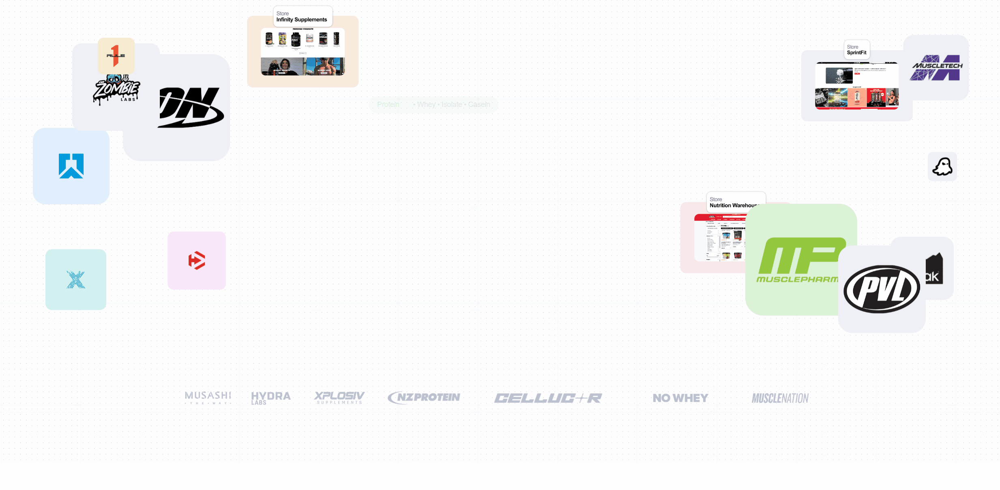
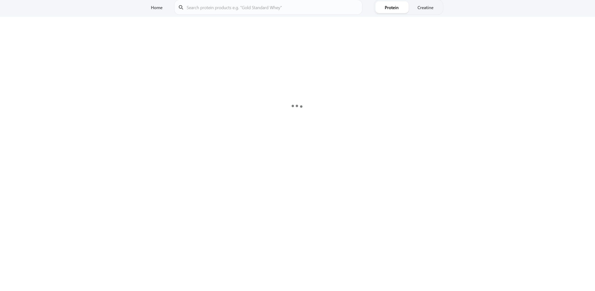

# SupplementSmarter

<p align="center">
  
</p>

<p align="center">
  🔗 <a href="https://www.supplement-smarter.com/">https://www.supplement-smarter.com/</a>
</p>

**SupplementSmarter** is a price-tracking + comparison app for supplements (starting with **protein** and **creatine**) built as a production-style full-stack project.

It combines a product browsing UI with a backend pipeline that **scrapes retailer listings**, **normalises product data**, and serves ranked results (value-first) plus **price history** and **all-time low** summaries.

---

## Problem & Approach

Supplement shopping is messy:

- retailer listings vary in naming/weights/flavours
- “cheap” isn’t always “best value”
- it’s hard to know if a price is actually good without history

SupplementSmarter addresses this by:

- scraping multiple NZ retailers into a consistent format
- normalising + filtering into category-specific tables
- ranking by **value score** (then price)
- showing **offers**, **price history**, and **all-time low / current low** for a product

<p align="center">
  
</p>

---

## Core Capabilities

- Protein + Creatine category pages, ranked by value
- Search suggestions across categories
- Product detail pages:
  - current offers (per retailer)
  - price history timeline
  - all-time low + current low summaries
- Scraping + normalisation pipeline (reproducible scripts)
- Test suite:
  - unit tests for normalisation
  - API integration tests (health + suggest)
  - scraper tests (field validation + runtime sanity)

---

## Technical Overview

### Frontend

- Vite + React + TypeScript
- Tailwind CSS
- Product tables, search suggestions, product pages
- Price history chart UI (range toggle + per-retailer lines)

### Backend (`/server`)

- Node.js + Express (TypeScript via `tsx`)
- PostgreSQL (`pg`)
- Endpoints:
  - `GET /health`
  - `GET /api/protein`
  - `GET /api/protein/suggest?q=...`
  - `GET /api/protein/:slug`
  - `GET /api/creatine`
  - `GET /api/creatine/suggest?q=...`
  - `GET /api/creatine/:slug`
  - `GET /api/supplements/suggest?q=...`

### Data Pipeline

- Playwright-based scrapers per retailer (protein + creatine)
- SQL scripts to:
  - apply schema
  - normalise raw scraped rows
  - build final category tables used by the API
- Price history table used for timelines + lows

---

## System Architecture

1. Scrapers collect product listings from retailers → store raw rows.
2. SQL normalisation standardises fields (name/brand/weight/currency, etc.).
3. Build scripts create “final” category tables and compute value ranking.
4. API serves:
   - ranked lists (value-first)
   - suggestions
   - product detail (offers + history + lows)
5. Frontend renders the comparison UI + charts.

This separation keeps scraping, normalisation, API, and UI **modular and testable**.

---

## Tests

From `server/`:

```bash
npm run test        # run everything
npm run test:watch  # dev watch mode

npm run test:unit   # unit tests
npm run test:api    # API integration tests
npm run test:scrape # scraper tests
npm run test:ci     # what CI runs (unit + api)
```

---

## License

MIT License
