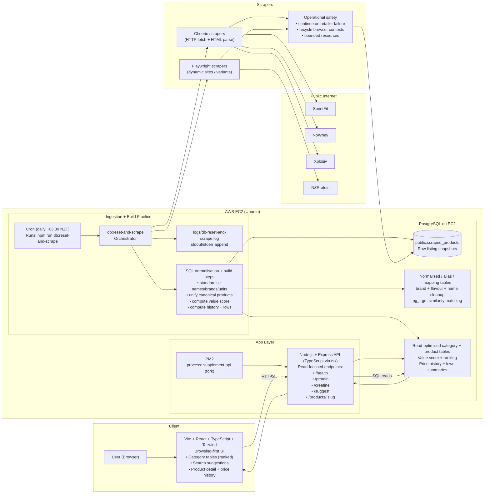
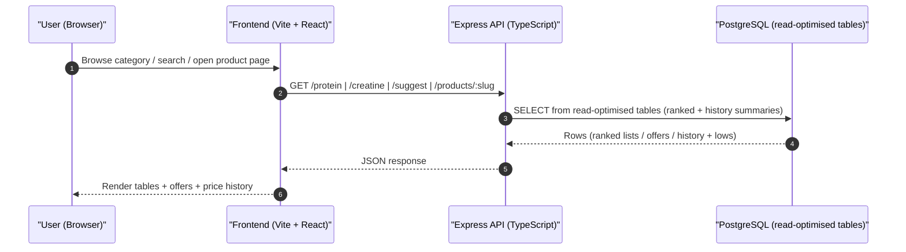
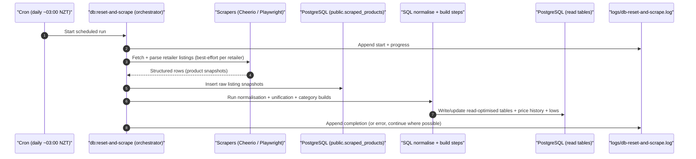

# SupplementSmarter - Architecture

This document shows the **request path** (user to UI to API to DB) and the **ingestion path** (cron to scrapers to raw snapshots to SQL normalisation/build to read-optimised tables)

---

## High-level system diagram

## Request path (runtime)

## Ingestion path (daily pipeline)

